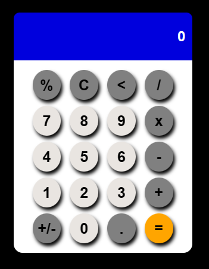

React Calculator

Projeto de uma simples calculadora feita com React.

Com este simples projeto foi possível utilizar

useState, useEffect, Styled-Components, Props para componentes e para Styled-Components

operações básicas de soma, subtração, multiplicação, divisão

